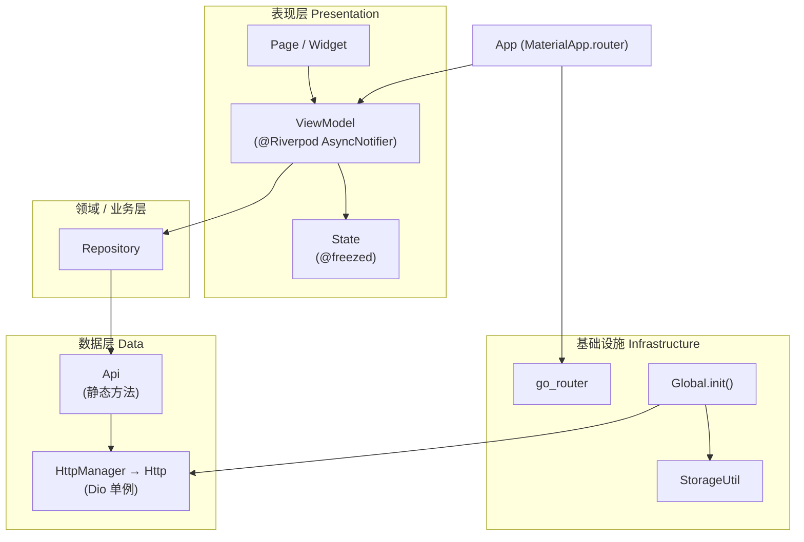

# anotherwanandroidflutter

基于 Flutter 开发的 **玩 Android（WanAndroid）** 客户端，对接 [wanandroid.com](https://wanandroid.com) 开放 API，采用 **Feature-First + MVVM** 分层架构，配合 **Riverpod** 状态管理与 **go_router** 声明式路由，实现首页资讯、体系、公众号、项目、个人中心等完整业务模块。

---

## 技术栈

| 类别 | 技术选型 | 说明 |
|------|----------|------|
| 框架 | Flutter 3.x / Dart ^3.9 | 跨平台 UI |
| 状态管理 | flutter_riverpod + riverpod_generator | 编译期 Provider 生成，支持 AsyncNotifier |
| 路由 | go_router ^16 | 声明式路由，自定义 Slide 转场 |
| 网络 | Dio ^5 + dio_cookie_manager | 单例 Http 封装，Cookie 持久化 |
| 数据模型 | freezed + json_serializable | 不可变数据类、JSON 序列化 |
| 表单校验 | formz | 登录用户名/密码校验 |
| UI 适配 | flutter_screenutil | 设计稿 1080×1920 等比缩放 |
| 下拉刷新 | easy_refresh | 统一 Header/Footer 配置 |
| 本地存储 | shared_preferences + AES 加密 | 登录态等持久化 |
| 其他 | webview_flutter、shimmer、card_swiper、connectivity_plus | WebView、骨架屏、Banner、网络重试 |

---

## 整体架构



### 分层职责

| 层级 | 目录 | 职责 |
|------|------|------|
| **入口** | `main.dart` / `app.dart` / `global.dart` | 初始化 Storage、Http、Android 沉浸式状态栏；挂载 `ProviderScope` 与 `MaterialApp.router` |
| **表现层** | `features/*/ui/` | Page、Widget、ViewModel、State；只关心 UI 与交互 |
| **业务层** | `features/*/repository/` | 聚合 API 调用、数据转换、异常封装 |
| **数据层** | `api/` + `http/` | API 路径常量、HTTP 请求；网络拦截与缓存 |
| **公共** | `common/`、`utils/`、`extensions/` | 主题色、图标、刷新配置、存储、加解密、Context 扩展 |

### 请求链路

```
UI 触发事件
  → ViewModel（AsyncNotifier）
    → Repository
      → Api（HttpManager.get/post）
        → Http（Dio + Interceptors）
          → wanandroid.com
  ← BaseResponse 解包 → 模型 fromJson → State 更新 → UI 重建
```

---

## 目录结构

```
lib/
├── main.dart                 # 入口：Global.init → ProviderScope → App
├── app.dart                  # 根 Widget：ScreenUtil、主题、路由、EasyLoading
├── global.dart               # 全局初始化
│
├── api/                      # 网络接口（按业务拆分）
│   ├── article/
│   ├── collect/
│   ├── login/
│   ├── navi/
│   ├── project/
│   ├── search/
│   ├── tree/
│   └── wxarticle/
│
├── http/                     # 网络基础设施
│   ├── http.dart             # Dio 单例、Cookie、拦截器链
│   ├── http_manager.dart     # 静态门面
│   ├── base_interceptor.dart # 统一响应解包（errorCode）
│   ├── base_response.dart
│   ├── retry_interceptor.dart
│   └── cache*.dart           # 可选内存/磁盘缓存
│
├── routing/
│   ├── routes.dart           # 路由常量
│   └── router.dart           # GoRouter + Slide 转场
│
├── features/                 # 功能模块（Feature-First）
│   ├── home/                 # 底部 Tab 容器
│   ├── article/              # 首页 Banner + 文章列表
│   ├── tree/                 # 知识体系
│   ├── wxarticle/            # 公众号
│   ├── project/              # 开源项目
│   ├── profile/              # 个人中心
│   ├── login/                # 登录表单（Formz）
│   ├── authentication/       # 登录态（全局 keepAlive）
│   ├── collect/              # 收藏列表
│   ├── search/               # 搜索
│   ├── navi/                 # 导航
│   └── common/               # 跨模块模型与 UI
│
├── common/                   # 全局 UI 资源
├── utils/                    # 存储、加密、Observer
└── extensions/               # BuildContext 主题扩展
```

### Feature 模块内约定

每个业务模块遵循统一结构，便于扩展与维护：

```
features/<feature>/
├── model/           # @freezed 领域模型
├── repository/      # @riverpod Repository Provider
└── ui/
    ├── *_page.dart          # 页面
    ├── state/               # @freezed UI 状态
    ├── view_model/          # @Riverpod ViewModel
    └── widget/              # 局部组件
```

---

## 核心模块说明

### 1. 应用启动

```dart
// main.dart
Global.init().then((_) {
  runApp(ProviderScope(
    observers: [AppObserver()],
    child: const App(),
  ));
});
```

`Global.init()` 依次完成：`WidgetsFlutterBinding` → `StorageUtil` → `HttpManager.init()` → Android 状态栏样式。

`App` 作为 `ConsumerWidget`，监听 `appThemeModeProvider` 与 `authenticationViewModelProvider`（全局登录态，`keepAlive: true`），保证登出/登入后全局状态同步。

### 2. 导航体系

- **一级导航**：`HomeScreen` 使用 `CupertinoTabBar` + `PageView`（禁用滑动），五个 Tab：
  - 首页 `ArticleScreen`
  - 体系 `TreePage`
  - 公众号 `WxArticlePage`
  - 项目 `ProjectPage`
  - 我的 `ProfilePage`
- **二级导航**：`BaseTabPage` 抽象 TabBar + PageView 联动，供体系/公众号/项目等多 Tab 场景复用。
- **独立路由**（`go_router`）：文章详情、搜索、登录、收藏、体系子页等，通过 `context.push(Routes.xxx)` 跳转，支持四向 Slide 转场。

### 3. 状态管理（Riverpod）

- **ViewModel**：`@Riverpod` / `@Riverpod(keepAlive: true|false)` 标注，由 `build_runner` 生成 `*.g.dart`。
- **State**：`@freezed` 不可变状态，配合 `copyWith` 做细粒度更新。
- **Repository Provider**：`@riverpod Future<XXXRepository>`，在 ViewModel `build()` 中 `ref.watch(xxxRepositoryProvider.future)` 注入依赖。
- **典型模式**：`AsyncValue.when(data / loading / error)` 驱动 UI；分页加载、下拉刷新通过 `ref.invalidate` 或 Notifier 方法更新。

**示例（文章收藏 — 乐观更新）**：

```dart
// 先更新 UI，失败则回滚
updateArticleCollectStatus(articleId, nextCollect);
try {
  await _collectRepository.collectArticle(id: articleId);
} catch (_) {
  updateArticleCollectStatus(articleId, currentCollect);
  rethrow;
}
```

### 4. 网络层

**Http 单例**（`http/http.dart`）拦截器链：

1. `BaseResponseInterceptor` — 校验 `errorCode`，包装为 `BaseResponse<T>`
2. `CookieManager` — `PersistCookieJar` 持久化 Cookie（登录会话）
3. `RetryOnConnectionChangeInterceptor` — 网络恢复后重试
4. `LogInterceptor` — Debug 下打印请求/响应

**Api 层**仅负责路径与参数，例如：

```dart
class ArticleApi {
  static Future<List<BannerData>> bannerList() async {
    return HttpManager.get(net_article_path_banner)
        .then((json) => List<Map>.from(json)
            .map((e) => BannerData.fromJson(e)).toList());
  }
}
```

**Repository 层**组合多个 Api、处理分页/置顶等业务规则（如首页第 0 页合并置顶文章）。

### 5. 认证与登录

| 组件 | 作用 |
|------|------|
| `LoginViewModel` | Formz 校验用户名/密码，调用 `LoginApi.login` |
| `AuthenticationViewModel` | 全局登录态，`onLogin` / `onLogout` |
| `AuthenticationRepository` | AES 加密读写 `SharedPreferences` 中的 User JSON |

登录成功后 Cookie 由 Dio 自动管理；用户信息本地加密缓存，App 启动时恢复 `AuthenticationState.authenticated`。

### 6. UI 与体验

- **ScreenUtil**：设计尺寸 `1080×1920`，全局适配。
- **EasyRefresh**：`EasyRefreshConfig` 单例统一上拉/下拉文案与样式。
- **Shimmer**：列表加载骨架屏（如首页）。
- **AutomaticKeepAliveClientMixin**：Tab 页保持滚动位置与状态。
- **自定义图标**：`fonts/iconfont.ttf` + `AndotherFonts` 图标常量。

---

## 功能模块一览

| 模块 | 功能 |
|------|------|
| `article` | Banner 轮播、置顶+分页文章、搜索入口、文章详情 WebView、收藏 |
| `tree` | 知识体系树形导航、二级分类文章列表 |
| `wxarticle` | 公众号 Tab、分类文章列表 |
| `project` | 项目分类 Tab、项目列表 |
| `search` | 热搜词、关键词搜索 |
| `collect` | 已登录用户收藏文章列表 |
| `navi` | 导航站点 |
| `login` | 用户名密码登录 |
| `profile` | 个人中心、收藏入口、退出登录 |

---

## 代码生成

项目大量使用注解驱动代码生成，修改 `@freezed` / `@riverpod` / `@Riverpod` 后需执行：

```bash
dart run build_runner build --delete-conflicting-outputs
```

生成物包括：

- `*.freezed.dart` — State / Model 的 copyWith、==、hashCode
- `*.g.dart` — JSON 序列化、Riverpod Provider 定义

---

## 环境要求与运行

**环境**

- Flutter SDK ^3.9
- Dart ^3.9

**安装依赖**

```bash
flutter pub get
dart run build_runner build --delete-conflicting-outputs
```

**运行**

```bash
flutter run
```

**分析**

```bash
flutter analyze
flutter test
```

---

## 架构特点总结

1. **Feature-First**：按业务垂直切分，模块内 Model / Repository / UI 闭环，降低耦合。
2. **单向数据流**：Api → Repository → ViewModel → State → UI，职责清晰，便于测试与替换。
3. **编译期安全**：Riverpod Generator + Freezed 减少手写样板与运行时错误。
4. **网络健壮性**：统一响应格式、Cookie 会话、断网重试、全局错误 Toast（EasyLoading）。
5. **可扩展**：新增功能只需在 `features/` 下复制模块结构，并在 `api/`、`router.dart` 中注册即可。

---

## 参考

- [玩 Android 官网](https://wanandroid.com/)
- [Flutter 文档](https://docs.flutter.dev/)
- [Riverpod 文档](https://riverpod.dev/)
- [go_router 文档](https://pub.dev/packages/go_router)
